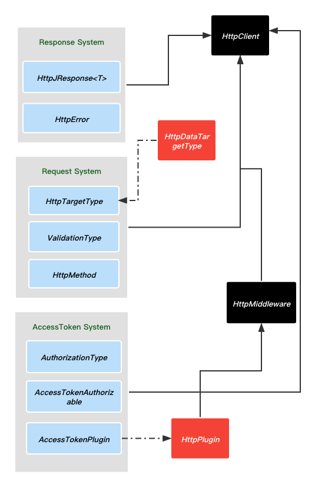

### Installation

##### yaml dependency

```yaml
http_client:
	git:
		url: 'git@gitlab.shuinfo.tech:shuinfo/app/flutter/http_client.git'
		ref: 'master'
```

### design

##### structure chart	



##### structural description

1. client由中间件,request system , response system, accesstoken system组成
2. 中间件由一组plugins组成
3. request system 由请求抽象抽象类，验证，请求方法组成
4. response system 由error 和response组成
5. 继承HttpPlugin 可以实现自定义Plugin，通过client加到中间件
6. 继承HttpDataTargetType 实现请求的所有参数和配置
7. 继承AccessTokenAuthorizable 配置accesstoken类型

### Example

1. 定义一组网络请求api的别名（一个module的或者一个业务类型的）

   ```dart
   enum SettingsHttpServerType {
     onShelf,
     authInfo,
     pickerUpOrder,
     putOperatingStatus
   }
   
   ```

2. 实现对应api的请求配置

   ```dart
   class SettingsHttpServer<T> extends HttpDataTargetType
       with AccessTokenAuthorizable {
     final SettingsHttpServerType _type;
     final T? _params;
     @override
     SettingsHttpServer({required SettingsHttpServerType type, T? params})
         : _type = type,
           _params = params;
     @override
     String get baseUrl => globalHttpConfig?.baseHost ?? "";
   
     @override
     String get path {
       switch (_type) {
         case SettingsHttpServerType.onShelf:
           return "/goods/pos/set/out_of_stock";
         case SettingsHttpServerType.authInfo:
           return "/tenant/pos/license/info";
         case SettingsHttpServerType.pickerUpOrder:
           final String orderId = (_params as PickerUpOrderParams).orderId;
           return "/order/pos/item/$orderId";
         case SettingsHttpServerType.putOperatingStatus:
           return "/store/pos/operating_status";
       }
     }
   
     @override
     Map<String, dynamic>? get parameters {
       switch (_type) {
         case SettingsHttpServerType.onShelf:
           return (_params as SettingsOnShelfParams).toJson();
         case SettingsHttpServerType.authInfo:
           return null;
         case SettingsHttpServerType.pickerUpOrder:
           return (_params as PickerUpOrderParams).toJson();
         case SettingsHttpServerType.putOperatingStatus:
           return {"status": 1};
       }
     }
   
     @override
     HttpMethod get method {
       switch (_type) {
         case SettingsHttpServerType.onShelf:
           return HttpMethod.post;
         case SettingsHttpServerType.authInfo:
           return HttpMethod.get;
         case SettingsHttpServerType.pickerUpOrder:
           return HttpMethod.post;
         case SettingsHttpServerType.putOperatingStatus:
           return HttpMethod.put;
       }
     }
   
     @override
     AuthorizationType get authorizationType => AuthorizationType.bearer;
   }
   ```

3. 统一封装发起的请求（可以根据业务近一步划分）

   ```dart
   //注：HttpClient应该封装在单例中， plugins的添加只添加一次。如下每个请求都添加只是演示。
     
   class SettingsApi {
     static void onShelf({required String targetId, required bool onShelf}) {
       if (globalHttpConfig != null) {
         HttpClient().addPlugin(
             plugin:
                 AccessTokenPlugin(token: globalHttpConfig?.accessToken ?? ""));
         HttpClient().addPlugin(plugin: HttpBaseConfigPlugin());
   
         Future<HttpJResponse<Map<String, dynamic>>> res = HttpClient().request(
           targetType: SettingsHttpServer(
               type: SettingsHttpServerType.onShelf,
               params:
                   SettingsOnShelfParams(targetId: targetId, onShelf: onShelf)),
         );
         res.then((value) => print("[Flutter] onShelf => $value"));
         res.catchError((e) {
           print("[Flutter] onShelf  error=> $e");
         });
       }
     }
   
     static void authInfo() {
       print('globalHttp =>$globalHttpConfig');
       if (globalHttpConfig != null) {
         HttpClient().addPlugin(
             plugin:
                 AccessTokenPlugin(token: globalHttpConfig?.accessToken ?? ""));
         HttpClient().addPlugin(plugin: HttpBaseConfigPlugin());
         Future<HttpJResponse<Map<String, dynamic>>> res = HttpClient().request(
           targetType: SettingsHttpServer(type: SettingsHttpServerType.authInfo),
         );
         res.then((value) => print("[Flutter] authInfo => $value"));
         res.catchError((e) {
           print("[Flutter] authInfo  error=> $e");
         });
       }
     }
   
     static void pickerUpOrder() {
       if (globalHttpConfig != null) {
         HttpClient().addPlugin(
             plugin:
                 AccessTokenPlugin(token: globalHttpConfig?.accessToken ?? ""));
         HttpClient().addPlugin(plugin: HttpBaseConfigPlugin());
         Future<HttpJResponse<Map<String, dynamic>>> res = HttpClient().request(
           targetType: SettingsHttpServer(
               type: SettingsHttpServerType.pickerUpOrder,
               params: PickerUpOrderParams(
                   orderId: "1694628326678726949", status: 30)),
         );
         res.then((value) => print("[Flutter] pickerUpOrder => $value"));
         res.catchError((e) {
           print("[Flutter] pickerUpOrder  error=> $e");
         });
       }
     }
   
     static void putOperatingStatus() {
       if (globalHttpConfig != null) {
         HttpClient().addPlugin(
             plugin:
                 AccessTokenPlugin(token: globalHttpConfig?.accessToken ?? ""));
         HttpClient().addPlugin(plugin: HttpBaseConfigPlugin());
         Future<HttpJResponse<Map<String, dynamic>>> res = HttpClient().request(
           targetType:
               SettingsHttpServer(type: SettingsHttpServerType.putOperatingStatus),
         );
         res.then((value) => print("[Flutter] putOperatingStatus => $value"));
         res.catchError((e) {
           print("[Flutter] putOperatingStatus  error=> $e");
         });
       }
     }
   }
   ```

4. 请求参数的配置

   ```dart
   class SettingsOnShelfParams {
     final String targetId;
     final int targetType;
     final bool onShelf;
     SettingsOnShelfParams(
         {required this.targetId, this.targetType = 2, required this.onShelf});
     Map<String, dynamic> toJson() {
       final Map<String, dynamic> data = {};
       data['targetId'] = targetId;
       data['targetType'] = targetType;
       data['onShelf'] = onShelf ? 2 : 1;
       return data;
     }
   }
   class PickerUpOrderParams {
     final String orderId;
     final int status;
     PickerUpOrderParams({required this.orderId, required this.status});
     Map<String, dynamic> toJson() {
       final Map<String, dynamic> data = {};
       data['order_id'] = orderId;
       data['status'] = status;
       return data;
     }
   }
   ```

5. 配置需要的plugin

   ```dart
   class HttpBaseConfigPlugin extends HttpPlugin {
     @override
     RequestOptions beforeCreateRequestOptions(
         {required RequestOptions options, required HttpTargetType type}) {
       print("HttpBaseConfigPlugin =>beforeCreateRequestOptions");
       options.headers['channel'] = globalHttpConfig?.headerChannel.toString();
       options.headers['app-identify'] = globalHttpConfig?.currentVersion;
       options.headers['pos-device'] = globalHttpConfig?.clientID;
       return options;
     }
   }
   ```

### Author

有问题联系

Jimmy，zhaofeng@shuinfo.com

